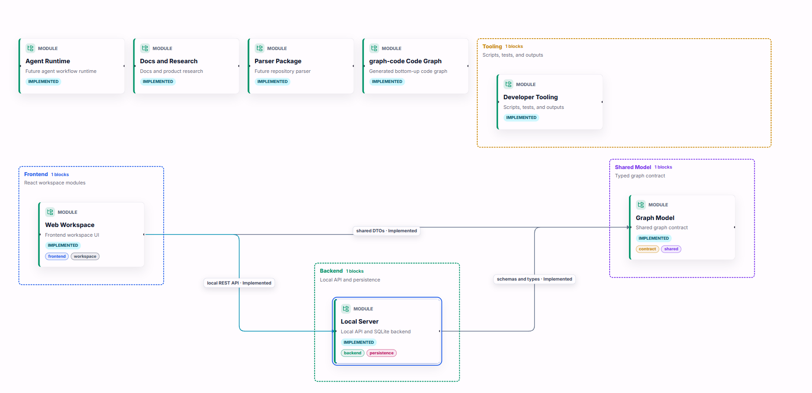
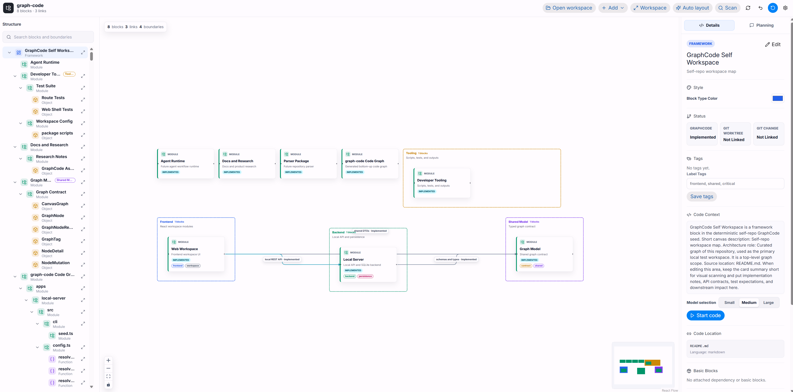
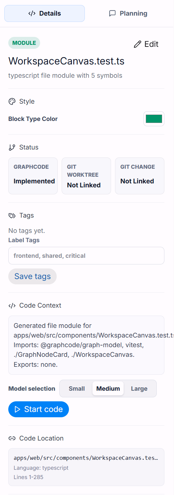
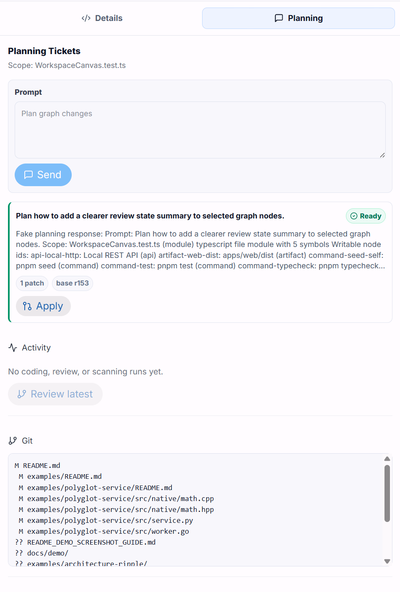
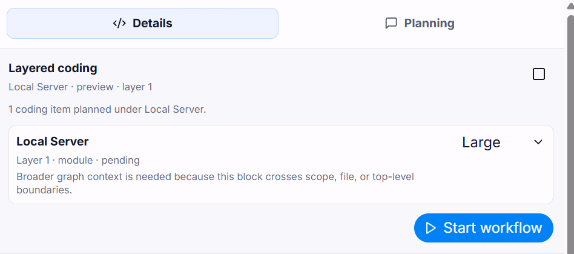
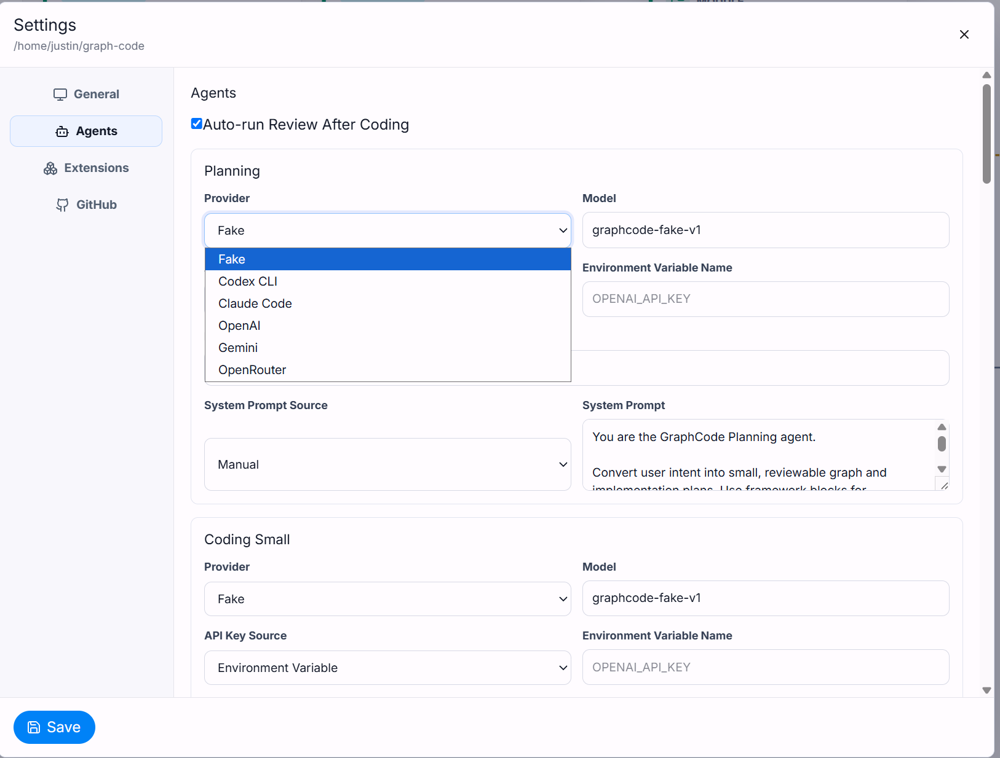
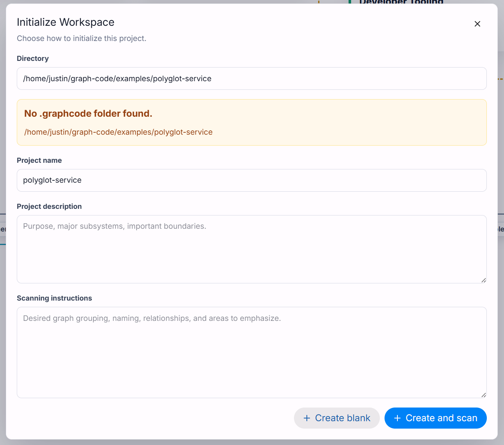

# GraphCode

GraphCode is a local, graph-native IDE prototype for transparent AI-assisted coding: it turns a repository into an interactive code graph so developers can inspect structure, scope AI work, and review proposed changes before anything is accepted.

Modern AI coding tools can touch many files quickly, but it is often hard to see what changed, why it changed, and what else might be affected. GraphCode explores a human-in-the-loop alternative: make the repository structure visible first, let users operate on source-linked graph nodes, and keep AI output as reviewable proposals rather than silent edits.

> Current status: GraphCode is a research and demo prototype. It is a local desktop-style web app, not a hosted service, and the voice/VR interface is future work rather than current functionality.

<p align="center">
  <a href="docs/demo/screenshots/00-demo.png">
    
  </a>
</p>

## Demo Gallery

Screenshots live in `docs/demo/screenshots/`. Click any preview to open the full-size image; refresh the gallery by replacing the PNGs with the same filenames.

<table>
  <tr>
    <td width="50%" valign="top">
      <a href="docs/demo/screenshots/01-workspace-overview.png">
        
      </a>
      <br>
      <strong>Workspace overview</strong>
      <br>
      <sub>Repository-scale graph canvas with hierarchy, source-linked blocks, and inspector panels.</sub>
    </td>
    <td width="50%" valign="top">
      <a href="docs/demo/screenshots/02-source-linked-inspector.png">
        
      </a>
      <br>
      <strong>Source-linked inspector</strong>
      <br>
      <sub>Exact source path, line range, dependencies, tags, and coding controls for a selected node.</sub>
    </td>
  </tr>
  <tr>
    <td width="50%" valign="top">
      <a href="docs/demo/screenshots/03-planning-tickets.png">
        
      </a>
      <br>
      <strong>Planning tickets</strong>
      <br>
      <sub>Planning tickets that turn intent into graph-scoped, reviewable work items.</sub>
    </td>
    <td width="50%" valign="top">
      <a href="docs/demo/screenshots/04-coding-review-loop.png">
        
      </a>
      <br>
      <strong>Coding review loop</strong>
      <br>
      <sub>Coding and review agents returning proposals, diffs, and review state instead of mutating files directly.</sub>
    </td>
  </tr>
  <tr>
    <td width="50%" valign="top">
      <a href="docs/demo/screenshots/05-agent-settings.png">
        
      </a>
      <br>
      <strong>Agent settings</strong>
      <br>
      <sub>Mode-specific agent settings for planning, coding, review, scanning, and local CLI providers.</sub>
    </td>
    <td width="50%" valign="top">
      <a href="docs/demo/screenshots/06-example-gallery-scan.png">
        
      </a>
      <br>
      <strong>Example gallery scan</strong>
      <br>
      <sub>Example repositories scanned into a graph to demonstrate mixed-language and workflow coverage.</sub>
    </td>
  </tr>
</table>

## What GraphCode Does

- Builds an interactive graph of files, modules, classes, functions, workflow blocks, dependencies, and impact relationships.
- Links graph nodes and edges back to exact source paths and line ranges.
- Provides a three-pane workspace with hierarchy search, React Flow canvas navigation, node inspection, and graph editing.
- Supports planning, scanning, coding, and review agents while keeping outputs as proposals, graph patches, diffs, or review verdicts.
- Stores local workspace state in `.graphcode/graphcode.sqlite`, ignored by git and owned by the opened repository.
- Runs locally through a React/Vite web app and Fastify/SQLite server.

## Why This Matters

GraphCode sits between manual file-by-file navigation and opaque autonomous agents. The research question is whether a graph-first interaction model can help developers understand, localize, edit, and review repository-scale changes with more confidence.

The current prototype emphasizes three ideas:

1. The graph is a working surface, not a decorative diagram.
2. AI actions should be scoped to visible nodes or subgraphs.
3. Review should remain explicit, with diffs, tests, dependencies, and blast-radius hints visible before acceptance.

## Quick Start

GraphCode is a local pnpm workspace. Use Node.js 22 LTS or newer with Corepack available, and run Node, pnpm, Git, and GraphCode from the same OS shell. A normal first launch starts blank; click **Open workspace** in the app and choose the repository folder you want GraphCode to manage.

### macOS

```bash
git clone <repository-url>
cd graph-code
corepack enable
corepack prepare pnpm@10.33.0 --activate
pnpm install
pnpm dev
```

Open `http://127.0.0.1:5173`, click **Open workspace**, and choose a repository folder. The web app runs through Vite on port `5173`; the local Fastify API runs on `127.0.0.1:3010`, and Vite proxies `/api` requests to the server.

### Linux

```bash
git clone <repository-url>
cd graph-code
corepack enable
corepack prepare pnpm@10.33.0 --activate
pnpm install
pnpm dev
```

Open `http://127.0.0.1:5173`, click **Open workspace**, and enter the repository folder path.

### Windows PowerShell

First-time setup:

1. Install Git for Windows.
2. Install Node.js 22 LTS for Windows.
3. Open a new Windows PowerShell or Windows Terminal window so the Node.js PATH update is loaded.
4. Clone the repository and start GraphCode:

```powershell
git clone <repository-url>
cd graph-code
node -v
corepack --version
corepack enable
corepack prepare pnpm@10.33.0 --activate
cmd /c pnpm install
cmd /c pnpm dev
```

Open `http://127.0.0.1:5173`, click **Open workspace**, and choose the repository folder in the folder picker.

The `cmd /c pnpm ...` form intentionally uses the Corepack `pnpm.cmd` shim. It avoids Windows PowerShell's script-execution policy blocking the generated `pnpm.ps1` shim.

For later runs:

```powershell
cd graph-code
cmd /c pnpm dev
```

On every OS, keep `pnpm dev` running while using the app.

For daily development after dependencies are installed, run `pnpm dev` directly on macOS/Linux or `cmd /c pnpm dev` in Windows PowerShell. Normal startup opens to a blank state until you choose a workspace; code graph refreshes preserve saved placements for stable nodes after a workspace is loaded.

Use `pnpm seed` only when you intentionally want the optional self-repo demo/reset fixture. It rebuilds the local self-repo fixture at `.graphcode/graphcode.sqlite` and erases local graph edits, saved placements, agent runs, and settings in that database.

## Codex Integration

GraphCode uses the local account-authenticated Codex CLI for Codex agents. Install and sign in to Codex from the same OS shell you use to start GraphCode, then open GraphCode settings and refresh **Integrations > Codex CLI**.

The model catalog command prints JSON and can be large, so the checks below redirect it to a temporary file.

### macOS

```bash
npm install -g @openai/codex
codex --version
codex login --device-auth
codex login status
codex doctor
codex debug models > /tmp/codex-models.json
ls -lh /tmp/codex-models.json
```

### Linux

```bash
npm install -g @openai/codex
codex --version
codex login --device-auth
codex login status
codex doctor
codex debug models > /tmp/codex-models.json
ls -lh /tmp/codex-models.json
```

If `codex` is not found after install, open a new terminal or add your npm global binary directory to `PATH`.

### Windows PowerShell

Use the `cmd /c` form from PowerShell so Windows runs the `.cmd` shims and avoids PowerShell script-execution policy blocks.

```powershell
cd C:\GitHub\graph-code
cmd /c npm install -g @openai/codex
cmd /c codex --version
cmd /c codex login --device-auth
cmd /c codex login status
cmd /c codex doctor
cmd /c "codex debug models > %TEMP%\codex-models.json"
Get-Item "$env:TEMP\codex-models.json"
```

If Windows cannot find `codex` after install, close and reopen PowerShell so the Node.js install directory is loaded into `PATH`, then rerun `cmd /c codex --version`.

## Feature Tour

### Repository Graph Workspace

GraphCode opens a repository workspace and renders a graph of source-backed entities. The current self-repo fixture includes frontend, backend, shared model, parser, agent runtime, docs, tooling, boundaries, tags, reusable placements, and saved layouts.

### Source-Linked Inspection

Selecting a node opens an inspector with its source path, source range, summary, code context, incoming and outgoing relationships, input/output boundary data, tags, and agent status. This is the core transparency layer for explaining what part of the repository an action refers to.

### Planning Tickets

The planning panel converts intent into graph-scoped tickets. Planning results can carry graph patches and conflict state, and applying a ticket is an explicit later action.

### Proposal-First Coding

Coding agents run in small, medium, or large modes. The mode controls how much graph and workflow context is included, but it does not grant unlimited edit scope. Provider outputs are stored as proposals and diffs so the user can inspect them before applying anything.

### Review Agents

Review agents mirror the coding modes and evaluate proposals for correctness, scope leaks, and missing verification. A review can mark the work as reviewed or bugged.

### Scanning Pipeline

Scanning is split into local, medium, and global passes. Local scans analyze source files, medium scans consolidate directory or package structure, and global scans synthesize cross-directory architecture. Generated scan rows are rebuildable, while manual graph edits are preserved.

### Local and Account-Based Providers

GraphCode supports deterministic fake providers for tests and demos, hosted providers such as OpenAI/Gemini/OpenRouter through API-key settings, and account-based Codex or Claude Code CLI providers. CLI providers are invoked so they return proposals to GraphCode rather than editing files directly.

## Examples

The `examples/` directory contains lightweight repositories designed for screenshots, demos, and scanner walkthroughs. They are intentionally outside the pnpm workspace, so they do not affect the normal build.

| Example | What to Show | Feature Coverage |
| --- | --- | --- |
| [polyglot-service](examples/polyglot-service) | Scan a mixed Python, Go, C++, SQL, and config service. | Mixed-language extraction, source ranges, import/call edges, workflow blocks. |
| [review-proposal-lab](examples/review-proposal-lab) | Ask for a node-scoped bug fix, then run review. | Proposal-first coding, review verdicts, missing-test discussion. |
| [architecture-ripple](examples/architecture-ripple) | Trace a contract change across billing, email, audit, and order-flow modules. | Impact relationships, dependency tracing, architecture reasoning. |
| [ui-api-workflow](examples/ui-api-workflow) | Inspect a UI action flowing into backend route handling. | Frontend/backend boundary, source-linked workflow navigation. |
| [extension-gallery](examples/extension-gallery) | Enable extension-oriented graph blocks and scan embedded/ML snippets. | Extension packages, domain-specific block kinds, settings screenshots. |

See [examples/README.md](examples/README.md) for the guided walkthrough prompts and screenshot suggestions.

## Architecture

```text
apps/
  web/              React and React Flow graph workspace.
  local-server/     Fastify API, SQLite persistence, workspace opening, scans, diffs.

packages/
  graph-model/      Shared TypeScript and Zod graph contracts.
  parser/           Deterministic TS/JS extraction plus common-language parsing.
  agent-runtime/    Planning, scanning, coding, and review agent orchestration.

docs/
  architecture/     Runtime and prompt design notes.
  research/         Prior-art assessment and research framing.

examples/           Demo repositories and screenshot walkthroughs.
```

Key implementation pieces:

- [apps/web](apps/web/README.md): web workspace, hierarchy, canvas, inspector, settings, and agent panels.
- [apps/local-server](apps/local-server/README.md): local API boundary, workspace persistence, routes, scanning, and graph updates.
- [packages/graph-model](packages/graph-model/README.md): shared graph DTOs, settings schemas, run schemas, and extension manifests.
- [packages/parser](packages/parser/README.md): repository parser that emits stable graph snapshot entities.
- [packages/agent-runtime](packages/agent-runtime/README.md): provider orchestration and proposal-only agent workflow.
- [docs/architecture](docs/architecture/README.md): design notes for prompts, scanning, and function workflow graphs.
- [docs/research](docs/research/README.md): research positioning and prior-art assessment.

## Current Scope and Limitations

- The current app is a local prototype intended for research demos and iteration.
- GraphCode is not yet a released cloud product, browser extension, or full replacement for a text IDE.
- Voice and VR operation are part of the long-term research direction and are not implemented in this checkout.
- The launch name is still open. The research notes identify other public uses of "GraphCode" or "Graph-Code," so naming should be revisited before a public launch.
- Generated workspace state is intentionally ignored by git. Examples and the screenshot directory are checked in, but `.graphcode/` databases are local runtime artifacts.

## Roadmap

1. Improve the graph workspace for large repositories with better filtering, grouping, and progressive disclosure.
2. Strengthen source-linked scanning and incremental graph refresh.
3. Make the proposal and review loop easier to evaluate with repeatable demo tasks.
4. Add formal user-study workflows for understanding, trust, review quality, and time-to-localize-change.
5. Explore voice control and VR presentation once the desktop graph workflow is stable.

## OS Notes

The same pnpm commands are intended to work on Linux, macOS, and Windows. The main differences are shell syntax, local paths, and optional native build tools for `better-sqlite3`.

- Linux paths look like `/home/alex/project`.
- macOS paths look like `/Users/alex/project`.
- Windows paths look like `C:\Users\Alex\project`.
- Workspace source paths inside GraphCode are stored with forward slashes, even on Windows.

Change ports on Linux or macOS:

```bash
GRAPHCODE_SERVER_PORT=4010 GRAPHCODE_WEB_PORT=5174 pnpm dev
```

Change ports in Windows PowerShell:

```powershell
$env:GRAPHCODE_SERVER_PORT = "4010"
$env:GRAPHCODE_WEB_PORT = "5174"
cmd /c pnpm dev
```

The Vite proxy reads `GRAPHCODE_SERVER_HOST`, `GRAPHCODE_SERVER_PORT`, and `GRAPHCODE_API_PROXY_TARGET`. The local API defaults to `127.0.0.1:3010`; the web app defaults to `127.0.0.1:5173`.

Account-based CLI providers also work cross-platform. On Windows, npm-installed CLI shims such as `codex.cmd` or `claude.cmd` are supported; if the command is not on `PATH`, enter the full path to the `.cmd` or `.exe` in settings.

Optional Docker smoke path:

```bash
docker build -t graphcode .
docker run --rm -p 3010:3010 -p 5173:5173 graphcode
```

## Verification

```bash
pnpm typecheck
pnpm test
pnpm build
```

The repository includes a GitHub Actions workflow that runs typecheck, tests, and build on Ubuntu, macOS, and Windows. The Docker image build is also verified on Ubuntu.

## License

GraphCode is released under the MIT License. See [LICENSE](LICENSE).
